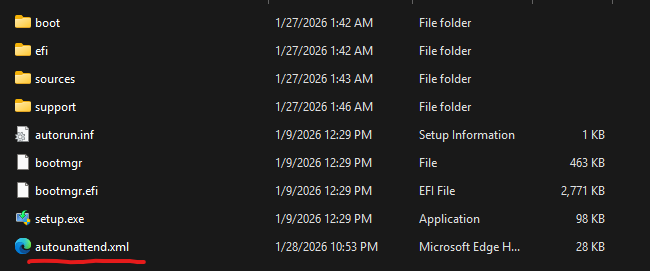

# Windows Automated Setup

Automated Windows installation and configuration using unattended installation and PowerShell scripts.


## Guide

### Step 1: Unattended Installation

Use `autounattend.xml` for fully automated Windows installation.

**Steps:**

1. Create bootable USB with Windows 11 using [MediaCreationTool](https://www.microsoft.com/en-us/software-download/windows11)
2. Copy `autounattend.xml` to USB drive root (not in any subfolder)
3. Boot from USB - installation proceeds automatically
4. System will reboot and complete setup on first login 


### Step 2: Post-Installation

Run on existing Windows installation:

```powershell
Invoke-Expression (Invoke-WebRequest "https://raw.githubusercontent.com/Jose-AE/auto-windows/main/init.ps1").Content
```
